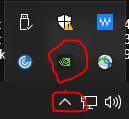
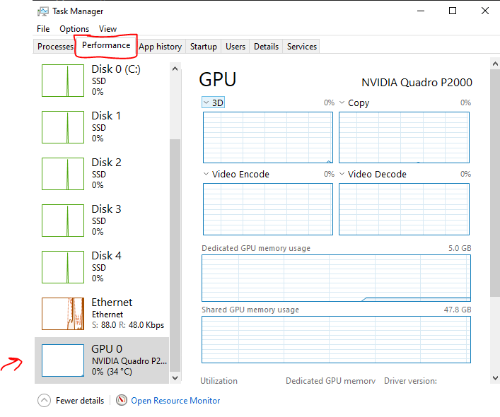
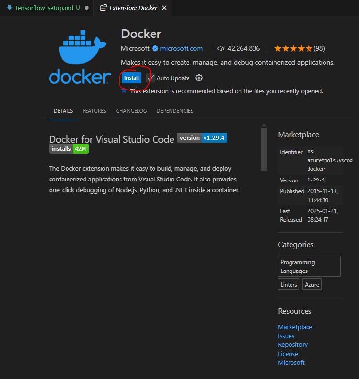
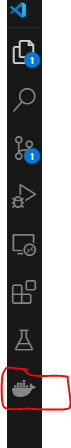

# Setting up Docker + GPU for PyTorch

This markdown file provides detailed instructions on how to setup Tensorflow with the GPU and Docker though you can treat both of these as separate problems, there is a crucial installation step which joins your local GPU to your Docker instance.

| **Feature**               | **Value**                                               |
|---------------------------|---------------------------------------------------------|
| **Platform**                  | Windows 10 Enterprise Edition PC with **admin rights**  |
| **Date**                      | 24th February, 2025                                 |
| **NVIDIA GPU** 🟩             | Quadro P2000                                        |
| **PyTorch version**           | 2.1.0+cu121                                         |
| **CUDA Toolkit**              | 12.1.0                                              |
| **Python Version**            | 3.9.15                                              |
| **Docker Version**  🐳        | 4.38.0                                             |
| **Works with Anaconda** 🐍    | ✔️                                                 |
| **Works with Miniconda** 🐍   | ✔️                                                |


## PyTorch 🔥 + GPU ⚡

Before you attempt to install this please make sure your device has a GPU. There are a few simple ways to check if you are not sure:

1) Use the taskbar: 
2) Check your task manager: 

The remaining steps for installing `PyTorch` on your machine will use a local `conda` environment. If you are interested in using a `devcontainer` then install `Docker` and skip ahead to the end of this guide which brings all of this together.

### Create a blank conda 🐍 environment

This step is very precarious. If at any point your install is corrupted (either due to incorrect installation methods or other issues) you will have to delete the environment and start from scratch.

Assuming you have `Anaconda3` or `miniconda3` on your system, in your Windows Anaconda Prompt type the following:

```bash
conda env create --name torch_temporal python=3.9
```

If it worked you will see something pop up asking for a whole bunch of default installs just hit `y` and press Enter ⏎

After it is done you should see something like:

```bash
(base) C:\
```

To activate your environment type:

```bash
conda activate torch_temporal
```

Then you should see:

```bash
(gnn_temporal) C:\
```

If you made it this far, well done! You now have a tucked away virtual environment ready for a lot of software.

The first thing we need to do now is install

## Docker 🐳

Dockerizing your project is a great way to freeze the development environment. It has the added benefit of being a more reproducible mechanism to ensure people working on your project do not have to struggle with packages/versioning etc. This is not your typical run of the mill Docker installation guide and actually includes a little bit of how-tos so you don't get lost in the installation.

### Step 1: Install Docker Desktop

Go to the [Docker homepage](https://www.docker.com/products/docker-desktop/) and install Docker Desktop for Windows 10 ARM-64 edition. It will require a restart, please say yes to all the default options and allow all of its popups.

### Step 2: Setup Docker for VS Code

Check the VS code extensions tab and install Docker.

After you are done installing it you should see it on the left hand side of your editor


When you click on it you should see `Containers`, `Images` and `Registries` pop up. Ok everything is ready and we can finally spin our first container.

### Step 3: Checking `WSL` and `nvidia-smi`

Usually after you install Docker you see your GPU on the command line. Type:

```bash
nvidia-smi
```

If you see some output you are all good but if you don't then `WSL` wasn't properly installed. You will need `Powershell` as **admin**. If you launch `Powershell` as **admin** then type:

```powershell
wsl --install
```

When it's done set it to `WSL 2`:

```powershell
wsl --set-default-version 2
```

### Step 4: Create a Dockerfile

Use `File > New Text File` and paste the following:

```dockerfile
# Use NVIDIA CUDA 12.1 base image
FROM nvidia/cuda:12.1.1-runtime-ubuntu22.04

# Set the working directory
WORKDIR /workspace

# Install system dependencies
RUN apt-get update && apt-get install -y \
    python3 python3-pip git && \
    rm -rf /var/lib/apt/lists/*

# Install PyTorch and DGL for CUDA 12.1
COPY requirements.txt /workspace/
RUN pip3 install --no-cache-dir -r requirements.txt

# Default to bash shell
CMD ["/bin/bash"]
```
### Step 5: Create `.devcontainer.json`

Note: That already exists for this project! In fact most of these files are there in this repo. This is for a fresh repo.

Example devcontainer:

```json
{
  "name": "TGNN Dev Container",
  "dockerFile": "Dockerfile",
  "runArgs": ["--gpus", "all"],
  "settings": {
    "terminal.integrated.defaultProfile.linux": "bash"
  },
  "extensions": [
    "ms-python.python",
    "ms-vscode-remote.remote-containers"
  ],
  "forwardPorts": [8888],
  "postCreateCommand": "pip install -r requirements.txt",
  "remoteUser": "root"
}
```

### Step 6: Create a `requirements.txt`

Note we are reusing bits of the `requirements.txt` from earlier on:

```
torch torchvision torchaudio --index-url https://download.pytorch.org/whl/cu121
dgl-cu121 -f https://data.dgl.ai/wheels/cu121/repo.html
```

### Step 7: Configure your GPU with Docker

**Note**: This step will cause your system to freeze a lot, this is normal

Before you begin running docker commands, run the Windows Powershell to confirm everything works:

```powershell
docker info
```

If this outputs something and you don't see: `Cannot connect to the Docker daemon` then you will need to reinstall and follow steps 3-6 again.

If it works open VS Code and do `Terminal > New Terminal`:

```powershell
docker run --rm --gpus all nvidia/cuda:12.1.1-devel-ubuntu22.04 nvidia-smi
```

It will check if there is a gpu toolkit for docker and if there isn't it will resort to installing it for you (about 2GB).

### Step 8: 
